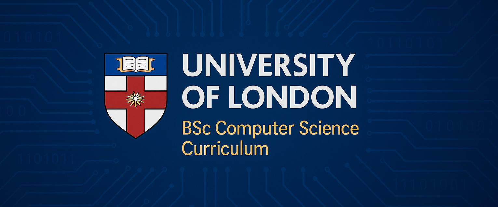

# University of London BSc Computer Science – Ders Planı

Bu repo, University of London’ın 2025 Bilgisayar Bilimi lisans programının (Level 4–6) tam müfredatını, modül tanımlarını ve haftalık tematik blok dağılımını içeren kapsamlı bir kaynaktır. Hem öğrenciler hem de eğitim tasarımcıları için adım adım yol gösterici olacak şekilde yapılandırılmıştır.

---

## 📖 Projenin Amacı

- **Modüllerin Tanıtımı:** Her seviyedeki zorunlu ve seçmeli modüllerin öğrenme hedefleri ve içerikleri  
- **Haftalık Blok Planı:** Her modülün 22 haftalık döneme bölünmüş 4–5 tematik bloğu  
- **Değerlendirme Yöntemleri:** Ödev, laboratuvar çalışmaları, ara sınavlar ve proje bileşenleri  
- **Uzmanlık Alanları:** Level 6’da seçilebilecek 7 ana uzmanlık alanı ve her alandaki modüler yapı  

---

## 🎓 Program Overview

**Seviye 4 (120 kredi)**  
Temel programlama, matematik, donanım ve algoritma kavramları.  
- 8 zorunlu modül; her biri 15 kredi  
- Günde ort. 2–3 saat çalışma ile 22 hafta süren program  

**Seviye 5 (120 kredi)**  
Uygulama odaklı yazılım tasarımı, veri işleme, güvenlik ve profesyonel pratikler.  
- 8 zorunlu modül; her biri 15 kredi  
- Gerçek dünya projeleri ve vaka incelemeleri  

**Seviye 6 (120 kredi)**  
Derinleşme ve bireysel bitirme projesi.  
- 6 seçmeli uzmanlık modülü (6 × 15 kredi)  
- Final Project (60 kredi)  

Detaylı Seviye 6 uzmanlık planları ve modül içeriği için [`docs/overview.md`](docs/overview.md) veya ilgili `syllabus/level6/specializations/` klasörlerini inceleyin.

---

## 🗂️ Repo Yapısı

```text
University-of-London-CS-Syllabus/
├── .gitignore
├── README.md                  # Bu dosya: Proje tanıtımı ve kullanım kılavuzu
├── docs/
│   ├── overview.md            # Programın genel açıklaması ve Level 4–6 özet
│   └── prospectus-ug-courses-computer-science-2025.pdf  
├── syllabus/
│   ├── level4/                # Seviye 4 modül tanımları
│   │   ├── 01-Introduction-to-Programming-I.md
│   │   └── ...  
│   ├── level5/                # Seviye 5 modül tanımları
│   │   ├── 01-Object-oriented-Programming.md
│   │   └── ...  
│   └── level6/
│       ├── core/              # Genel BSc modülleri
│       └── specializations/   # Seviye 6 uzmanlık alanları
│           ├── data-science/
│           ├── games-development/
│           └── ...  
└── assets/
    └── diagrams/              # Akış şemaları, blok diyagramları vb.